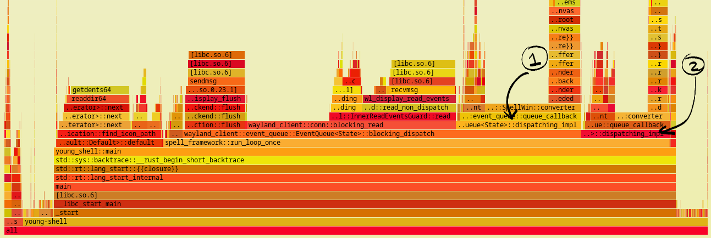
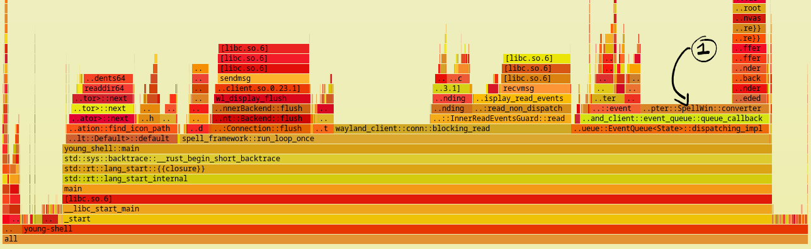
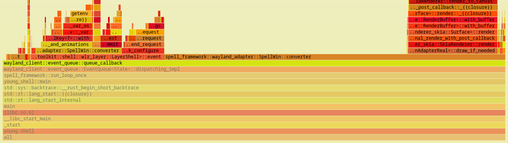
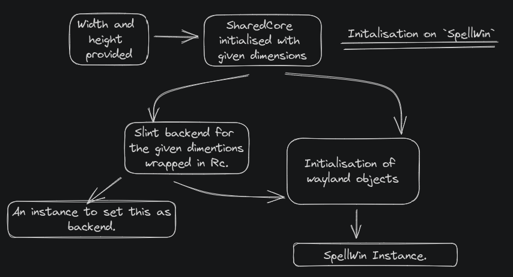
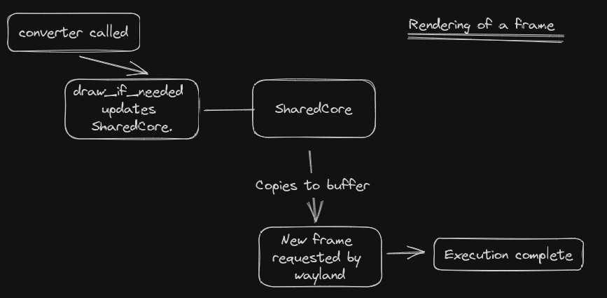
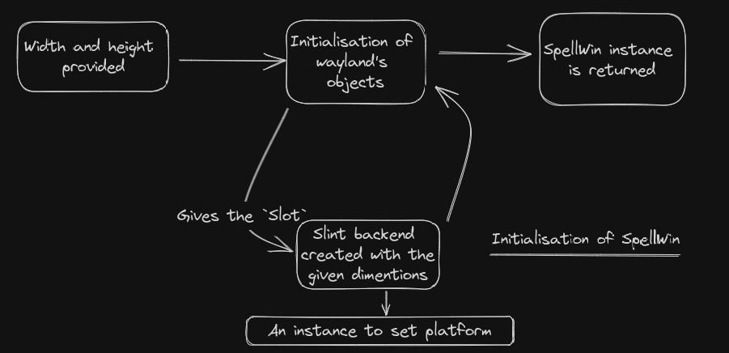
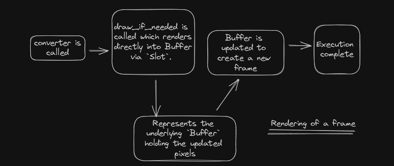
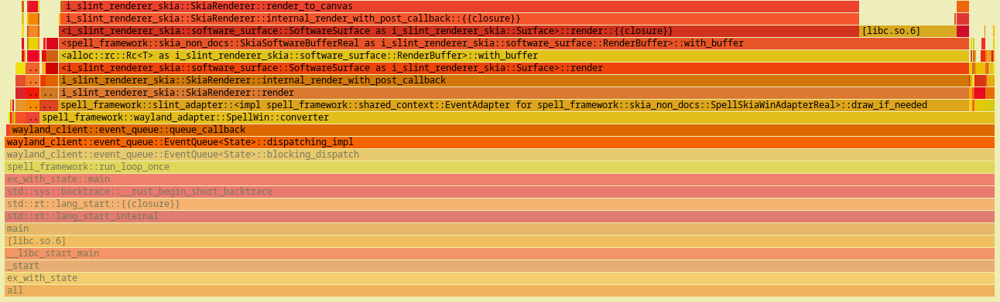

  id:: 68ae71d1-d38e-4cd9-8499-47eda5c8f23a
  public:: true
  tags:: theoretical-writeups, technical
  description:: Performance improvement for frame rendering in my library
  lang:: rust
#[[Blog Posts]]  
  
-
- In this article, we are going to go through following:
	- A basic reference of what the performance issue was.
	  logseq.order-list-type:: number
	- Initial analysis approach with logging and results of logs.
	  logseq.order-list-type:: number
	- Brief section about `perf` and how it can be used in this scenario.
	  logseq.order-list-type:: number
	- Understanding the issue with `flamegraph` outputs.
	  logseq.order-list-type:: number
	- Previous architecture of program and why it was used.
	  logseq.order-list-type:: number
	- Exploring possible solutions and their limitations.
	  logseq.order-list-type:: number
	- Results after application of optimal approach in performace.
	  logseq.order-list-type:: number
	- Discussing further improvements in rendering and possible assumptions.
	  logseq.order-list-type:: number
	- Concluding the article with updated `flamegraph` output with better performance.
	  logseq.order-list-type:: number
- ## Introduction
- So, to give some context,
-
  > I  have been making a library called **Spell** which provides a backend of slint to create desktop widgets for linux ricing.  
- There are a lot of words in the previous sentence which may not make sense. Let us go through them in reverse Desktop linux users may be familiar with the word "ricing". Daily driving linux as your primary desktop machine has a lot of perks. One get greater control over the OS (and hardware) and endless customizability options. One such customisation is a clean slate of "display" without any UI components. So you don't have top bars, app launchers, docks, panels, lock screens etc. This can be done when you opt out of using community maintained desktop environments (like gnome, plasma etc) and go on to just use a window manager (or wayland compositor in this case). The system thus configured remains extremely light and minimal. You can then install  3rd party tools or code these UI components yourself. People create their own workflows from scratch. This gives a fresh look to your desktop and the exact setup you want.
- Traditionally, these UI components are made in GTK UI toolkit. Plasma (by KDE) uses Qt for its applications. To easy the development of creating these widgets/UI components, various people have created frameworks that applies abstraction over GTK to ease out the process. Rather than making another GTK widget toolkit, Spell explores a unique gap. It provides the backend of slint, a declarative language,  to create these UI components. My choice of integrating slint for this use case is due to its versatility and great integration with rust which helped in the process of porting it to wayland. Now, I received a recent issue on CPU usage maxing to 100 percent when using spell. The article discusses how the performance is improved and the issue is fixed.
- There are a lot of words in the previous sentence which may not make sense. Let us go through them in reverse. Desktop linux users may be familiar with the word "ricing". Daily driving linux as your primary desktop machine has a lot of perks. One get greater control over the OS (and hardware) and endless cutomizability options. One such customisation is a clean slate of "display" without any UI components. So you don't have top bars, app launchers, docks, panels, lock screens etc. This can be done when you opt out of using community maintained desktop environments (like gnome, plasma etc) and go on to just use a window manager (or wayland compositor in this case). The system thus configured remains extremely light and minimal. You can then install  3rd party tools or code these UI components yourself. People create their own workflows from scratch. This gives a fresh look to your desktop and the exact setup you want.
- Traditionally, these UI components are made in GTK UI toolkit. Plasma (by KDE) uses Qt for its applications. To ease the development of creating these widgets/UI components, various people have created frameworks that applies abstraction over GTK to ease out the process. Rather than making another GTK widget toolkit, Spell explores a unique gap. It provides the backend of slint, a declarative language,  to create these UI components. My choice of integrating slint for this use case is due to its versatility and great integration with rust which helped in the process of porting it to wayland. Now, I received a recent issue on CPU usage maxing to 100 percent when using spell. The article discusses about how the performance is improved and the issue is fixed.
- ## Initial Response
- I wasn't surprised by the issue as I was also having some performance issues when using spell in rust's debug profile. I thought the problem originated from weak CPU power of my system but the issue confirmed that spell's rendering is not optimised and can be improved. I first added some print statements to see how long it takes to render a buffer( a chunk of memory where the UI's pixel data is stored, generally in the form of arrays) to screen. The result is following:
-
  ```
  Skia Elapsed Time: 0
  Normal Elapsed Time: 0
  Release 110 @ (14.37109375, 29.28515625)
  Keyboard focus entered
  Keyboard focus entered
  This trait implementation of RenderBuffer is Run
  Skia Elapsed Time: 8
  Normal Elapsed Time: 126
  This trait implementation of RenderBuffer is Run
  Skia Elapsed Time: 14
  Normal Elapsed Time: 121
  This trait implementation of RenderBuffer is Run
  Skia Elapsed Time: 14
  Normal Elapsed Time: 124
  This trait implementation of RenderBuffer is Run
  Skia Elapsed Time: 14
  Normal Elapsed Time: 124
  This trait implementation of RenderBuffer is Run
  Skia Elapsed Time: 9
  Normal Elapsed Time: 127
  This trait implementation of RenderBuffer is Run
  Skia Elapsed Time: 3
  Normal Elapsed Time: 126
  Skia Elapsed Time: 0
  Normal Elapsed Time: 0
  ```
- The section shows logs for a 200ms animation on the buffer. Some things to note:
	- When there no changes/interactions, the rendering time is zero milliseconds,this can be seen at the start and end of these logs.
	  logseq.order-list-type:: number
	- Each buffer's repainting produces 3 logs, the time it took slint's backend skia to change pixel, represented by `Skia Elapsed Time`, the time it took to process for wayland by `Normal Elapsed Time` and if the frame is actually updated or not by printing `This trait implementation of RenderBuffer is Run` if true.
	  logseq.order-list-type:: number
	- This log is the highest every time it took to produce a new frame, generally the time for Skia rendering varies around  9 ms and for processing it took around 32 ms on average, so though the value is fluctuating, (like here it took as long as 130 ms for a frame), on average it took 40 ms to produce a frame (in release profile).
	  logseq.order-list-type:: number
- This shows some scope of improvement, if it takes on average 40 ms to produce a new frame, for a 200ms, I was only getting 5 frame, hence resulting in jerky animations. So, these logs do help in understanding where the maximum amount of time is being taken, yet the hike in CPU can't be explained by logs alone, they provide the time data but not the computation details.
- This shows some scope of improvement, if it takes on average 40 ms to produce a new frame, for 200ms, I was only getting 5 frames, hence resulting in jerky animations. So, these logs do help in understanding where the maximum amount of time is being taken, yet the hike in cpu can't be explained by logs alone, they provide the time data but not the computation details.
- So, when searching for the tools to access the computational details, I recalled I had bookmarked [this](https://phoenixnap.com/kb/linux-perf) page on `perf` command when reading the mail of Andres Freud about the xz vulnerability (out of curiosity). Surfing further brought me to `flamegraph` (and extension `cargo-flamegraph` for rust projects) which can show perf output into an interactive graph svg for better interpretation of program. So, let's understand a bit about how `perf` works.
- ### How does perf work, in layman's terms?
- I was intrigued by `perf` and wanted to know how it works internally to produce such necessary performance information. Turns out, modern processors have special registers called Hardware performance pointers. As per Wikipedia, these store counts of hardware-related activities, which are further used for performance analysis in certain aspects. Modern OS kernels provide APIs to access information by these registers. This is exploited by perf.
- Flamegraphs then uses perf's metrics to produce these graphs, how to interpret them is best explained on their website. Quoting:
-
  > The x-axis shows the stack profile population, sorted alphabetically (it is not the passage of time), and the y-axis shows stack depth, counting from zero at the bottom. Each rectangle represents a stack frame. The wider a frame is is, the more often it was present in the stacks.  
- Stack profile population is basically a trace of which functions are called and how often a function/instruction call occurs. So, with this info in place we can analyse some data output.
- ## The issue
- When looking at the (rather boring ) perf output, I could only figure out the fact that a custom function of mine has a rather equal or more biased CPU percentage to `Self` than to the slint drawing it calls, but the structure of wayland involve various checks and callbacks, so the overhead mechanism of wayland was shadowing the data. So, I moved towards looking flamegraphs, which gave a rather clear picture. The primary graph looked like this:
- {:height 300, :width 870}
- A few thing to notice:
	- First of all `..ault::Default::default` entry left of `spell_framework::run_loop_once` is unrelated to the topic of analysis because it represents some other utility initialisation.
	  logseq.order-list-type:: number
	- `run_event_loop` is the custom function called on each iteration of frame. First optimisation can be noticed here, the function calls `block_displatch`and a `dispatching_impl`(mark 2) methods wherein `blocking_dispatch` itself calls `dispatching_impl`(mark 1) internally. In a single iteration, the process of dispatching of events need not happen twice, so I removed `blocking_dispatch` in favour of calling `blocking_read` and `dispatching_impl` directly once. This brought some improvement. The changed code produced the following graph.
	  logseq.order-list-type:: number
- {:height 276, :width 870}
- On further analysis:
	- `run_loop_once` calls 3 sequential functions in it, namely:
	  logseq.order-list-type:: number
		- `flush` : Flushes old requests of updation of the UI if pending.
		  logseq.order-list-type:: number
		- `blocking_read`: internal wayland function which seeks new requests. It uses half of it computational work in `Self` and almost half in call `InnerEventGaurd::read`, but since this is an internal function provided by wayland_client, there can be no optimisations by me.
		  logseq.order-list-type:: number
		- `dispatching_impl`: called by the event queue to run the callback function which renders the new frame. It internally calls `SpellWin::converter`(mark **1**) which is a custom function I made. It has scope of improvement, let's zoom in to understand the distribution.
		  logseq.order-list-type:: number
	- It is important to note that even though `flush` and `blocking_read` holds more space in the graph, they are repeated functions with very less computational work. They block to read input/events, the CPU works more in rendering the new buffer to pixels.
	  logseq.order-list-type:: number
- {:height 254, :width 870}
- This graph tells a singular thing very prominently. the `draw_if_needed`(top right) function is what calls the Skia renderer on the buffer memory chunk to update the pixels, so of all the time `converter` takes to process, only about 25 percent is utilised in actual rendering, the rest is the processing of new information. It is at this point I understood what was going wrong. Here is a actual snippet for you to guess(though the function shouldn't make sense without context but I have added comments for help) ?
-
  ```rust
      fn converter(&mut self, qh: &QueueHandle<Self>) {
        	// Initialisation and setting basic vars.
          slint::platform::update_timers_and_animations();
          let width: u32 = self.size.width;
          let height: u32 = self.size.height;
          let window_adapter = self.adapter.clone();
        
          if !self.is_hidden.get() {
               // Rendering from Skia
              let redraw_val: bool = window_adapter.draw_if_needed();
  
              let pool = &mut self.memory_manager.pool;
              let buffer = &self.memory_manager.wayland_buffer;
              let primary_canvas = buffer.canvas(pool).unwrap();
            
            // Converting slint array for wayland memory Buffer
              if redraw_val || self.first_configure {
                  {
                      primary_canvas
                          .iter_mut()
                          .enumerate()
                          .for_each(|(index, val)| {
                              *val = self.core.borrow().primary_buffer[index];
                          });
                  }
              }
            
            	// Leftover layer calls for asking new frame and reattaching updated Buffer.
              self.first_configure = false;
              self.layer.wl_surface().damage_buffer(0, 0, width as i32, height as i32);
              self.layer.wl_surface().frame(qh, self.layer.wl_surface().clone());
              self.layer.wl_surface().attach(Some(buffer.wl_buffer()), 0, 0);
          }
          self.layer.commit();
      }
  ```
- The issue is at line 19. Technically, this instruction copies every array element to the buffer. Element of buffer are simply `u8` (unsigned int of 8 bits) values where 4 consecutive values represent a pixel (in RGBA format). So, on every frame the whole memory space carrying the pixels were being copied. This was an expensive process. For example for a 500 width and 800 height widget the memory array would be of length `500 * 800 * 4 = 1,600,000`. And this array was copied almost every time.
- So, now we know the issue. It is still important to understand why I wrote such code and how can I mitigate the copying by possible solutions.
- ## Why this architecture was chosen?
- A spell window (called `SpellWin`) is composed of 2 components, the primary being the wayland part and secondarily an `Rc` (reference counter) to the slint backend (can be seen as `self.window_adapter` in the above code). The backend of slint is called for redrawing, parsing key input events, touch input events and cursor pointer input events.`Buffer` is a struct provided by Smithay (maintain's port of wayland in rust) for accessing the underlying memory which stores the pixels. The issue is  that Buffer can't be passed to slint backend during the initialisation of `SpellWin` as its mutable reference is required for features like:
- Hiding window from screen, without clearing the buffer.
  logseq.order-list-type:: number
- Reappearing of window, without redrawing.
  logseq.order-list-type:: number
- Showing only a section of Buffer.
  logseq.order-list-type:: number
- As one may know, a mutable reference can't be accessed if value is behind a reference counter. Buffer can not be wrapped by RefCell due to some trait requirements. So, I came up with a `SharedCore` (a struct storing arrays of pixels for various buffers) wrapped in `Rc<RefCell<>>` and passed an instance to both slint and wayland. Then, when `draw_if_needed` was called slint made changes to `SharedCore`, later complete array of SharedCore was copied into Buffer for rendering. Both initialisation and rendering is shown below.
- **Initialisation**
  [[draws/2025-08-25-15-33-18.excalidraw]]  
  {:height 469, :width 854}  
-
- **Rendering of a Frame**
  [[draws/2025-08-25-15-45-15.excalidraw]]  
    
- ## Exploring Solutions
- So, what are my options here. Given the problem to share same memory chunk of Buffer between 2 separate processes. Let's explore possible alternatives and see if one can fit into this architecture. It is important to mention that `Buffer` doesn't implement clone. It is provided/ created by another struct call `SlotPool` responsible for creating buffers of various sizes. Also the fact that a `Slotpool`'s instance is always necessary to grab the underlying canvas (i.e. `&mut [u8]`) of a Buffer to write over the memory directly.
- The first and most direct approach is to merge the structs of slint's backend and wayland objects, that way wayland's wouldn't have to hold a stance of slint's backend, rather it would become slint's backend. The approach poses 2 primary restrictions which can not be overlooked.
	- Slint need a backend to be set for it to use it. Otherwise, slint chooses the default rendering mechanism to show the UI. This will end up in creation of an application window for desktop. This will not be appropriate as we want widgets to be made from slint.
	  logseq.order-list-type:: number
	- Slint's platform setting mechanism expect an Rc wrapped instance of the new backend due to its structure of APIs. But then the whole window of slint **and wayland** would need to be wrapped and parsed. Resulting in the fact that all methods of `SpellWin` would need to be converted from `&mut self` to `&self`.
	  logseq.order-list-type:: number
- Another obvious approach is to pass both `Buffer` and `SlotPool` to slint, yet again this approach poses some issues of its own.
	- This makes my code less readable given the fact that the distinction between slint's backend and wayland's objects are not properly separated.
	  logseq.order-list-type:: number
	- Even if they could be passed, all other functionalities of wayland reside within `SpellWin` directly. So even though the buffer could be updated directly, the change couldn't be transferred to an actual visual frame. 
	  logseq.order-list-type:: number
- I did try to implement this architectural change and after 2 days of work I started bumping into runtime errors of reference already being borrowed mutable so I had to revert back.
- Only when I was about to ask the same on a forum I decided to sweep the docs one last time to ensure these values can't be copied. There I came across a method of `Buffer` which yielded a struct called `Slot`. This was a basic object whose only job was to provide the underlying memory chunks. Surplus to it, `Slot` could also be cloned since all the clones would point to same pixels.
- So, I came up with the approach that during initialisation, an instance of `Slot` of a `Buffer` would be passed to slint. When a new frame be called, Skia (slint's backend) would directly write to pixels via `Slot`, then buffer could be directly pushed for the new frame.
- **Initialisation**
  [[draws/2025-08-26-23-11-32.excalidraw]]  
    
- **Rendering of a frame**
  [[draws/2025-08-27-06-58-13.excalidraw]]  
    
- ## Expected results
- So, after the work of another few days I was able to fight the compiler and brought this architecture into my code. The next thing was to check the performance improvements which this experiment bought, so I looked up the logs to find the rendering of buffers with an average of 8 ms. With all the copying time stripped, normal rendering of skia is at 8ms so it is all that was left. Hence, now a 200 ms animation had 25 frames rather than 5 which is a great improvement. With these changes in place I closed the issue with the Author of issue satisfied. Added "Massive performance improvement in rendering" in my CHANGELOG.md and call it a win.
- ## Scope for more optimisation?
- When I started with this project, frame's rendering was at 140 ms, I brought it down to 40 and now 7ms. So, further changes may bring very light improvements. Also, with this rate the library will be compatible with a monitor of frame rate as high as 120Hz. Nonetheless, currently my loop runs indefinitely when there is no change in buffer. this loop should be brought to sleep for the frame rate of monitor rendering upon. Hence, preventing loops from over run. blocking the loop is not optimal as it hosts events from multiple sources and blocking on one would cause issues in submission of events from these other sources. Other improvement can be seen in line 30 of the code I provided. Since damaging the buffer for a new frame takes a rectangular space in local coordinate system, this can be modified to enable partial rendering from the data skia provides. It would have to be seen though if extra computation of calculating rectangles is worth the time cut provided by partial rendering. Another metric which is left but should be considered is the actual time to render a buffer into frame.
- ## Conclusion
- So, with everything in place, here is the updated flamegraph of `run_loop_once`. You can notice that `converter`'s time is mostly invested in calling the rendering only.
- 
- With this, we have reached the end of the blog, thanks for reading it. Provide any inputs and contact me for suggestions. Thank you and Happy Coding !
